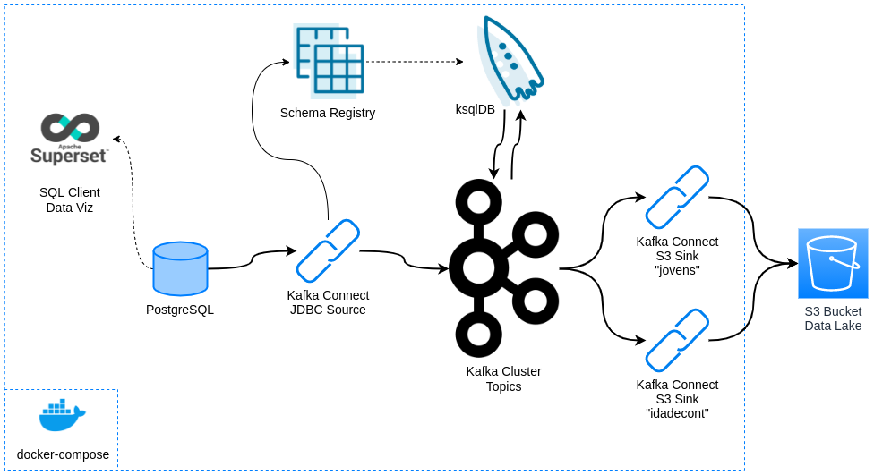

# Kafka Exercise

### Prof. Neylson Crepalde

#### Abril de 2021

Exercício para praticar uma pipeline de Streaming de Dados com Kafka. Vamos implementar a seguinte arquitetura:

Integração do Kafka com uma database (postgresql) usando *kafka connect*, processamento de dados em streaming com *ksqlDB* e entrega em data lake com *kafka connect*. Para consultas simples, vamos utilizar o Superset (embora você possa escolher o cliente SQL de sua preferência). Todos os serviços que compõem o kafka, o superset e a database PostgreSQL que servirá de fonte serão implantadas com `docker-compose`.



---

# Passo a passo para execução

## 1 - Pré-requisitos

- Docker
- docker-compose
- Uma conta AWS free tier

## 2 - Configurar o arquivo .env_kafka_connect

Você deve criar um arquivo `.env_kafka_coonect` para cadastrar as chaves de sua conta aws como variáveis de ambiente que serão injetadas dentro do container do kafka connect. O arquivo deve ser conforme o modelo:

```
AWS_ACCESS_KEY_ID=xxxxxxxxxxxxxxxxxxx
AWS_SECRET_ACCESS_KEY=xxxxxxxxxxxxxxxxxxxxxxxxxxxxxxx
```

## 3 - Subir a plataforma Confluent no docker-compose + PostgreSQL

No arquivo `docker-compose.yml` estamos subindo toda a estrutura da plataforma Confluent junto com a database PostgreSQL que servirá de fonte. Para isso, vamos clonar o projeto, entrar na pasta e subir a estrutura.

```bash
git clone https://github.com/neylsoncrepalde/kafka-exercise.git
cd kafka-exercise
docker-compose up -d
```

Este código yml também cria uma rede externa na qual o superset será implantado para que todos os serviços consigam "se enxergar".

## 4 - Subir o superset

Em seguida vamos subir os serviços do superset. O arquivo `docker-compose-non-dev.yml` na pasta superset já disponibiliza os serviços da ferramenta na rede externa criada pelo outro arquivo.

```bash
cd superset
docker-compose -f docker-compose-non-dev.yml up -d
 ```


## 5 - Executar o gerador de dados *fake*

Em seguida, retorne à pasta root do projeto e execute o gerador de dados fake.

```bash
cd ..
python make_fake_data.py
```

O módulo `make_fake_data.py` possui 4 argumentos que podem ser utilizados na linha de comando. Acrescente `--interval` para definir quantos segundos o simulador vai aguardar entre as simulações, `-n` para definir quantos casos serão simulados por vez, `--connection-string` ou `-cs` para definir uma string de conexão customizada (para reaproveitamento do módulo em outra database) e `--silent` caso não desejemos exibir os dados simulados na tela.

Abaixo, a documentação do comando

    usage: make_fake_data.py [-h] [--interval INTERVAL] [-n N]
                         [--connection-string CONNECTION_STRING]
                         [--silent [SILENT]]

    Generate fake data...

    optional arguments:
    -h, --help            show this help message and exit
    --interval INTERVAL   interval of generating fake data in seconds
    -n N                  sample size
    --connection-string CONNECTION_STRING, -cs CONNECTION_STRING
                            Connection string to the database
    --silent [SILENT]     print fake data

Será necessário executar o simulador apenas uma vez para criar a tabela na database.

## 6 - Criar um tópico no Kafka

Vamos criar um tópico no kafka que irá armazenar os dados movidos da fonte.

```bash
docker-compose exec broker kafka-topics --create \
    --bootstrap-server localhost:9092 \
    --partitions 1 \
    --replication-factor 1 \
    --topic psg-customers
```

O sufixo do nome do tópico deve possuir o mesmo nome da tabela cadastrado no arquivo `make_fake_data.py` caso seja necessário customizar.

## 7 - Registrar os parâmetros de configuração do connector no kafka

Para isso, vamos precisar de um arquivo no formato `json` contendo as configurações do conector que vamos registrar. O arquivo `connect_postgres.config` possui um exemplo de implementação. O conteúdo do arquivo está transcrito abaixo:

```json
{
    "name": "postg-connector",
    "config": {
        "connector.class": "io.confluent.connect.jdbc.JdbcSourceConnector",
        "tasks.max": 1,    
        "connection.url": "jdbc:postgresql://postgres:5432/postgres",
        "connection.user": "postgres",
        "connection.password": "SUA-SENHA",
        "mode": "timestamp",
        "timestamp.column.name": "dt_update",
        "table.whitelist": "public.customers",
        "topic.prefix": "psg-",
        "validate.non.null": "false",
        "poll.interval.ms": 500
    }
}
```

Com o arquivo, fazemos uma chamada à API do Kafka para registrar os parâmetros:

```bash
curl -X POST -H "Content-Type: application/json" \
    --data @connect_postgres.config http://localhost:8083/connectors
```

Este comando cria um conector que irá puxar todo o conteúdo da tabela mais todos os novos dados que forem inseridos. **Atenção**: O Kafka connect não puxa, por default, alterações feitas em registros já existentes. Puxa apenas novos registros. Para verificar se nossa configuração foi criada corretamente e o conector está ok, vamos exibir os logs.

```bash
docker logs -f connect
```

e verifique se não há nenhuma mensagem de erro. 

## 8 - Iniciar um stream no ksqlDB

Para iniciar o ksqlDB, fazemos

```bash
docker-compose exec ksqldb-cli ksql http://ksqldb-server:8088
```

Antes de começar, vamos conferir se nosso tópico foi criado corretamente. Na *CLI* do ksqlDB, faça

```
ksql> show topics;
```

    Kafka Topic                 | Partitions | Partition Replicas 
    ---------------------------------------------------------------
    default_ksql_processing_log | 1          | 1                  
    psg-customers               | 1          | 1                  
    ---------------------------------------------------------------

para mostrar os tópicos criados. Para verificar se nosso conector está rodando corretamente, podemos fazer

```
ksql> show connectors;
```

    Connector Name  | Type   | Class                                         | Status                      
    -------------------------------------------------------------------------------------------------------
    psg-connector   | SOURCE | io.confluent.connect.jdbc.JdbcSourceConnector | RUNNING (1/1 tasks RUNNING) 
    -------------------------------------------------------------------------------------------------------

O Status deve estar como RUNNING.

OK! O Kafka agora está puxando dados da tabela e registrando no tópico `psg-customers`. Podemos conferir o fluxo de dados no tópico com

```
ksql> print psg-customers;
```

Isso vai exibir as mensagens como ficam registradas no tópico. Para consumir o dado de uma maneira mais interessante, podemos criar um STREAM:

```
ksql> create stream custstream WITH (kafka_topic='psg-customers', value_format='AVRO');
```

Após a mensagem de confirmação, podemos verificar o stream assim:

```
ksql> show streams;
```

    Stream Name         | Kafka Topic                 | Key Format | Value Format | Windowed 
    ------------------------------------------------------------------------------------------
    CUSTSTREAM          | psg-customers               | KAFKA      | AVRO         | false    
    KSQL_PROCESSING_LOG | default_ksql_processing_log | KAFKA      | JSON         | false    
    ------------------------------------------------------------------------------------------

Para fazer uma consulta rápida ao stream (apenas exibí-lo na tela), podemos fazer

```
ksql> select * from custstream emit changes;
```

O output dessa consulta não é dos melhores. Além de conter um número grande de colunas, dificultando a visualização, todas as colunas de data estão nos formatos INT ou BIGINT o que não é nada intuitivo para interpretação. Podemos fazer uma consulta mais enxuta e já corrigindo essas datas com o seguinte código:

```
ksql> select nome, telefone, email, 
>DATETOSTRING(nascimento, 'yyyy-MM-dd') as dt_nascimento,
>TIMESTAMPTOSTRING(dt_update, 'yyyy-MM-dd HH:mm:ss.SSS', 'UTC') as dt_updt_conv
>from custstream emit changes;
```

A consulta retorna a seguinte tabela:

    +-------------------------+-------------------------+--------------------------+-------------------------+-------------------------+
    |NOME                     |TELEFONE                 |EMAIL                     |DT_NASCIMENTO            |DT_UPDT_CONV             |
    +-------------------------+-------------------------+--------------------------+-------------------------+-------------------------+
    |Scott Johnson            |+1-475-559-2163x6531     |michelle01@example.org    |1970-01-01               |2021-04-12 23:26:03.655  |
    |Amy Shannon              |902-547-6469             |michaelrogers@example.com |1969-12-31               |2021-04-12 23:26:04.211  |
    |Julie Kane               |+1-817-150-3155          |austin36@example.net      |1970-01-01               |2021-04-12 23:26:04.758  |
    |Sheri Fuller             |9634802570               |savannahduncan@example.net|1969-12-31               |2021-04-12 23:26:05.285  |

Bem mais interessante!

## 9 - Criando uma tabela com processamento em tempo real

Primeiro, vamos criar um stream que filtra apenas as pessoas "jovens" (aqui definido como quem nasceu depois de 2000-01-01) e armazena esses dados no tópico `jovens`. O tópico será criado ao criar o stream.

```
ksql> create stream jovens WITH (kafka_topic='jovens', value_format='AVRO') AS
>select nome, telefone, email, profissao,
>DATETOSTRING(nascimento, 'yyyy-MM-dd') as dt_nascimento,
>TIMESTAMPTOSTRING(dt_update, 'yyyy-MM-dd HH:mm:ss.SSS', 'UTC') as dt_updt
>from custstream
>WHERE DATETOSTRING(nascimento, 'yyyy-MM-dd') >= '2000-01-01'
>emit changes;
```

Se checarmos novamente as streams,

```
ksql> show streams;
```

    Stream Name         | Kafka Topic                 | Key Format | Value Format | Windowed 
    ------------------------------------------------------------------------------------------
    JOVENS              | jovens                      | KAFKA      | AVRO         | false    
    CUSTSTREAM          | psg-customers               | KAFKA      | AVRO         | false    
    KSQL_PROCESSING_LOG | default_ksql_processing_log | KAFKA      | JSON         | false    
    ------------------------------------------------------------------------------------------

Agora, vamos criar um stream que fará a classificação das pessoas entre jovens e adultos e uma tabela que fará a contagem de jovens e adultos a cada 30 segundos.

```
ksql> create stream idadeclass WITH (kafka_topic='idadeclass', value_format='AVRO') AS
>select nome, telefone, email, profissao,
>CASE
>WHEN DATETOSTRING(nascimento, 'yyyy-MM-dd') >= '2000-01-01' THEN 'JOVEM'
>ELSE 'ADULTO' END AS idadecat,
>TIMESTAMPTOSTRING(dt_update, 'yyyy-MM-dd HH:mm:ss.SSS', 'UTC') as dt_updt
>from custstream
>emit changes;
```

E depois

```
ksql> create table idadecont WITH (kafka_topic='idadecont', value_format='AVRO') AS
>select idadecat, count(idadecat) as contagem
>from idadeclass
>window tumbling (size 30 seconds)
>group by idadecat
>emit changes;
```

E teremos uma tabela contando cada caso de JOVEM e ADULTO para cada intervalo de 30 segundos.

## 10 - Ingestão de tópicos no S3

Vamos agora configurar outro tipo de connector, um *sink connector* para entregar dados armazenados no tópico `jovens` no S3. Para isso, precisamos de um arquivo de configuração do conector similar ao que elaboramos antes, mas agora com outros parâmetros. Vamos nomeá-lo `connect_s3_sink_jovens.config`:

```json
{
    "name": "s3-jovens-sink",
    "config": {
        "connector.class": "io.confluent.connect.s3.S3SinkConnector",
        "format.class": "io.confluent.connect.s3.format.parquet.ParquetFormat",
        "flush.size": 10,
        "schema.compatibility": "FULL",
        "s3.bucket.name": "NOME_DO_BUCKET",
        "s3.region": "REGIÃO_AWS",
        "s3.object.tagging": true,
        "s3.ssea.name": "AES256",
        "topics.dir": "raw-data/kafka",
        "storage.class": "io.confluent.connect.s3.storage.S3Storage",
        "tasks.max": 1,
        "topics": "jovens"
    }
}
```

E vamos cadastrá-lo no cluster connect:

```bash
curl -X POST -H "Content-Type: application/json" \
    --data @connect_s3_sink_jovens.config http://localhost:8083/connectors
```

Vamos criar também uma configuração de conector para entregar dados do tópico `idadecount` para o S3 Vamos chamá-la de `connect_s3_sink_count.config`.

```json
{
    "name": "s3-contagem-sink",
    "config": {
        "connector.class": "io.confluent.connect.s3.S3SinkConnector",
        "format.class": "io.confluent.connect.s3.format.json.JsonFormat",
        "keys.format.class": "io.confluent.connect.s3.format.json.JsonFormat",
        "schema.generator.class": "io.confluent.connect.storage.hive.schema.DefaultSchemaGenerator",
        "flush.size": 10,
        "schema.compatibility": "NONE",
        "s3.bucket.name": "NOME_DO_BUCKET",
        "s3.region": "REGIÃO_AWS",
        "s3.object.tagging": true,
        "s3.ssea.name": "AES256",
        "topics.dir": "raw-data/kafka",
        "storage.class": "io.confluent.connect.s3.storage.S3Storage",
        "tasks.max": 1,
        "topics": "idadecont",
        "store.kafka.keys": true
    }
}
```

E então, cadastrá-lo no cluster connect:

```bash
curl -X POST -H "Content-Type: application/json" \
    --data @connect_s3_sink_count.config http://localhost:8083/connectors
```

PRONTO!! Agora os dados dos tópicos estão sendo entregues no bucket S3 definido. Vamos verificar no ksql se está tudo OK com os conectores:

```
kqsl> show connectors;
```

---

**Parabéns**!! Você acabou de concluir o seu pipeline de processamento de dados em tempo real usando a plataforma Confluent no docker-compose!